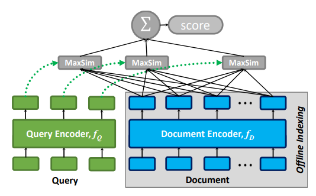

# ColBERT

(Unofficial) Pytorch implementation of ColBERT: [Efficient and Effective Passage Search via Contextualized Late Interaction over BERT](https://arxiv.org/abs/2004.12832)

## Model Architecture

<p float="left" align="center">
      
</p>

## Dependencies

* python==3.8
* torch==1.13.1
* transformers==4.26.1

## Dataset

|       | Train  | Dev | Test |
| ----- | ------ | --- | ---- | 
|  ai_stages data | 3952  | 240 | 240  | 
| Wiki Corpus | 57000 | - | -  |

## Training & Evaluation
```bash
$ python main.py --config {base_config} \
                 --mode {train} 
```

